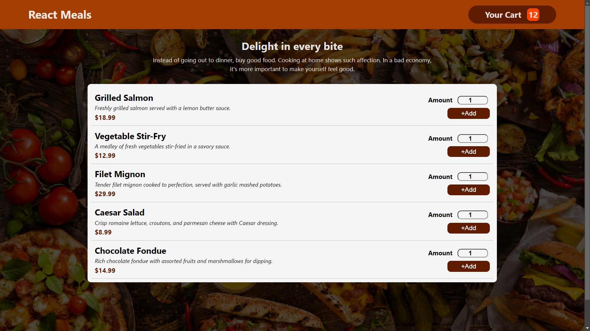
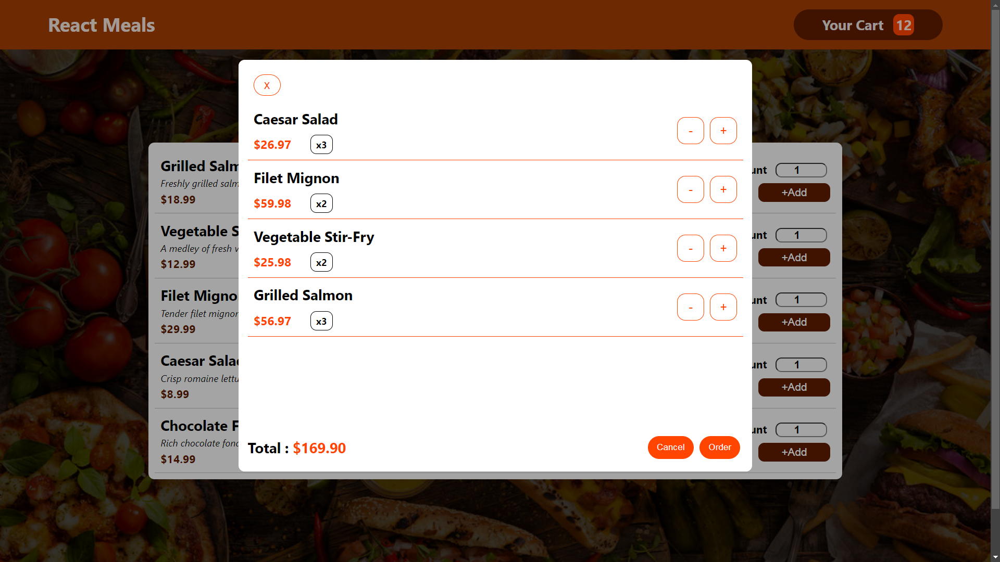

# Live Site 
[LiveSite](https://food-order-dynamics.netlify.app/)

# Food Order App
This a simple Dummy Food-Order App. This is one is practice project.
In this we can Add our Food Item to the Cart and from there we can order our food.
At this momment the order functionality does not work cause i didn't built it yet.
It will be included in the future version of this application.

## Some Basic Feature

- We can add our food to the Cart by giving a serving number.
- We can increase and decrease that serving number from that Cart.
- The Cart Menu show us the total price of our food.

## Upcoming Feature

1. There will be unique landing page for running our promotional campaing.
2. There will be an Admin user who can operate the whole application. by operate i mean add new food item. increase decrease there price.
3. There will be User Authentication feature soon

# Here's some of picture of ui
## HomePage right now.

## CartMenu 

 

And This is for Now.
